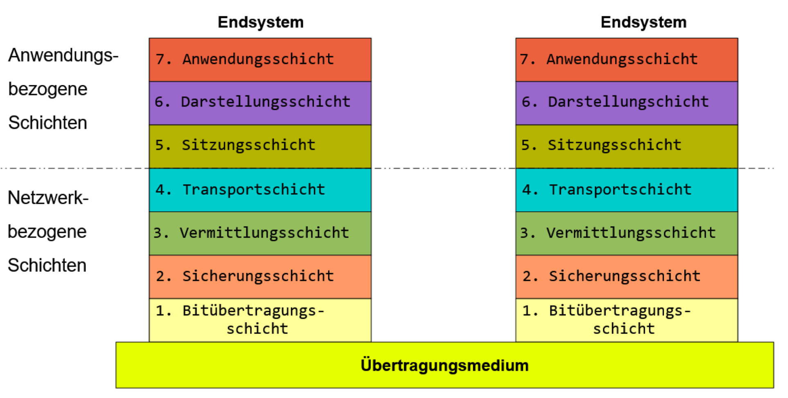
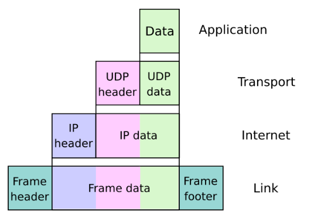

# OSI-Modell

Das **OSI-Referenzmodell** (Open Systems Interconnection Model) ist ein theoretisches Schichtenmodell, das beschreibt, wie Daten in einem Netzwerk übertragen werden. Es teilt die Netzwerkkommunikation in **sieben Schichten** auf, wobei jede Schicht spezifische Aufgaben hat und mit der darüber- oder darunterliegenden Schicht interagiert. Ziel ist es, die Netzwerkkommunikation besser zu verstehen, zu standardisieren und zu modularisieren.

Hilfreich ist das Verständnis unter anderem bei der Fehlersuche bzw. erlangen wir dadurch ein grundlegendes Verständnis über den Ablauf der Datenübertragung.

## Die sieben Schichten des OSI-Modells

### 1. Schicht 7: Anwendungsschicht (Application Layer)
- **Funktion**: Schnittstelle für Benutzer und Anwendungen, die auf Netzwerke zugreifen.
- **Aufgabe**: Bereitstellen von Diensten wie Dateiübertragung, E-Mail, Webzugriff.
- **Beispiele**: HTTP, FTP, SMTP, DNS.

### 2. Schicht 6: Darstellungsschicht (Presentation Layer)
- **Funktion**: Übersetzung, Verschlüsselung und Kompression von Daten.
- **Aufgabe**: Daten in ein Format bringen, das vom Empfänger verstanden werden kann.
- **Beispiele**: SSL/TLS (für Verschlüsselung), Textcodierung (z. B. UTF-8, ASCII).

### 3. Schicht 5: Sitzungsschicht (Session Layer)
- **Funktion**: Steuerung und Synchronisierung von Kommunikationssitzungen.
- **Aufgabe**: Aufbau, Verwaltung und Beendigung von Sitzungen zwischen Endsystemen.
- **Beispiele**: Sitzungssteuerung in RPCs (Remote Procedure Calls).

### 4. Schicht 4: Transportschicht (Transport Layer)
- **Funktion**: Zuverlässige oder unzuverlässige Datenübertragung.
- **Aufgabe**: Segmentierung, Fehlerkorrektur und Flusskontrolle.
- **Protokolle**:
  - **TCP** (Transmission Control Protocol): Zuverlässig, verbindungsorientiert.
  - **UDP** (User Datagram Protocol): Unzuverlässig, verbindungslos.

### 5. Schicht 3: Netzwerkschicht (Network Layer)
- **Funktion**: Routing und Adressierung von Datenpaketen.
- **Aufgabe**: Daten von der Quelle zum Ziel transportieren, unabhängig von der physischen Verbindung.
- **Protokolle**: IP (IPv4, IPv6), ICMP, OSPF.

### 6. Schicht 2: Sicherungsschicht (Data Link Layer)
- **Funktion**: Bereitstellung einer fehlerfreien Übertragung über ein einzelnes physisches Netzwerk.
- **Aufgabe**: Fehlererkennung, Fehlerkorrektur und Steuerung des Datenflusses.
- **Protokolle**: Ethernet, Wi-Fi (802.11), PPP.

### 7. Schicht 1: Physische Schicht (Physical Layer)
- **Funktion**: Übertragung der Rohdaten (Bits) über ein physisches Medium.
- **Aufgabe**: Definition von Kabeln, Signalen, Frequenzen und physischer Verbindung.
- **Beispiele**: Netzwerkkabel, elektrische Signale, Lichtimpulse (bei Glasfaser).

## Kommunikation im OSI-Modell

Datenübertragung erfolgt von der **höchsten Schicht** (Schicht 7, Anwendung) zur **untersten Schicht** (Schicht 1, Physik). Jede Schicht fügt spezifische Steuerinformationen hinzu (z. B. Header), bevor die Daten an die nächste Schicht übergeben werden. Dieser Prozess wird als **Encapsulation** bezeichnet. Beim Empfang erfolgt die **Decapsulation**, wobei die Steuerinformationen entfernt werden.

## Vorteile des OSI-Modells

1. **Standardisierung**: Bietet eine einheitliche Grundlage für die Entwicklung und Nutzung von Netzwerken.
2. **Modularität**: Änderungen in einer Schicht beeinflussen andere Schichten nicht.
3. **Fehlersuche**: Probleme können gezielt in einer bestimmten Schicht lokalisiert werden.
4. **Herstellerunabhängigkeit**: Ermöglicht Interoperabilität zwischen Systemen verschiedener Hersteller.

## Vergleich mit dem TCP/IP-Modell

Das OSI-Modell wird hauptsächlich als theoretisches Konzept verwendet, während das **TCP/IP-Modell** in der Praxis häufiger Anwendung findet. Das TCP/IP-Modell hat nur **vier Schichten**, die mehrere OSI-Schichten zusammenfassen:

- **Netz(werk)zugang** (entspricht Schicht 1-2) - physische Infrastruktur: Ethernet-Kabel, WLANs, Netzwerkschnittstellenkarten, Gerätetreiber ...
- **Internet** (entspricht Schicht 3) - steuert Fluss und Weiterleitung des Datenverkehrs
- **Transport** (entspricht Schicht 4) - zuverlässige Datenverbindung, teilt Daten in Pakete auf, bestätigt Pakete von Sender und Empfänger (TCP, UDP), Ende-zu-Ende-Kommunikation
- **Anwendung** (entspricht Schicht 5-7 des OSI-Modells) - gewährt Benutzenden Zugang zum Netz (HTTP, FTP, E-Mail (POP, SMTP), Messenger), was Nutzende sehen/interagieren

- **TCP** (*Transmission Control Protocol*) - für Datenübermittlung verantwortlich (sendet und empfängt die Post)
- **IP** *Internet Protocol* - ermittelt die IP Adresse (sortiert die Post)

TCP benötigt eine IP Adresse, um Daten zu senden.

## Encapsulation

**Encapsulation** (Einbettung) beschreibt den Prozess, bei dem Daten in einem Netzwerkprotokoll in eine **Hülle aus Steuerinformationen** (Header) eingepackt werden, bevor sie zur Übertragung an die nächste Schicht weitergeleitet werden. Jede Schicht des **OSI-Referenzmodells** fügt dabei ihre eigenen spezifischen Informationen hinzu. Diese zusätzlichen Informationen ermöglichen es, dass die Daten korrekt übertragen, adressiert, geroutet und interpretiert werden können.

### Ablauf der Encapsulation

1. **Start in der Anwendungsschicht (Schicht 7)**:  
   Die Rohdaten (z. B. ein HTTP-Request) werden generiert und an die nächste Schicht weitergegeben.

2. **Hinzufügen von Steuerinformationen**:  
   Jede Schicht fügt ihrer Funktion entsprechende Steuerinformationen in Form eines **Headers** hinzu. In einigen Fällen (z. B. Schicht 2) kann auch ein **Trailer** hinzugefügt werden.

3. **Weitergabe an die nächste Schicht**:  
   Die eingekapselten Daten werden als "Payload" (Nutzlast) an die darunterliegende Schicht weitergegeben, die wiederum eigene Informationen hinzufügt.

4. **Schicht 1: Physikalische Übertragung**:  
   Auf der untersten Schicht (Schicht 1) werden die vollständig enkapsulierten Daten als elektrische Signale, Lichtimpulse oder Funkwellen über das physische Medium übertragen.

### Beispiel für Encapsulation (HTTP über TCP/IP)

Ein HTTP-Request, der über das Internet gesendet wird, durchläuft folgende Schichten:

1. **Anwendungsschicht (HTTP)**:  
   Der Request wird als Datenstrom erzeugt (z. B. `GET /index.html HTTP/1.1`).

   Wir fassen hierbei die Schichten 5 bis 7 zusammen.

2. **Transportschicht (TCP)**:  
   Ein **TCP-Header** wird hinzugefügt, der Informationen wie Quell- und Zielport enthält. Die Daten heißen nun **TCP-Segment**.

3. **Netzwerkschicht (IP)**:  
   Ein **IP-Header** wird hinzugefügt, der Quell- und Ziel-IP-Adressen enthält. Die Daten heißen jetzt **IP-Paket**.

4. **Sicherungsschicht (Ethernet)**:  
   Ein **Ethernet-Header** (z. B. MAC-Adressen) und ein **Trailer** (z. B. für Fehlererkennung) werden hinzugefügt. Die Daten heißen nun **Ethernet-Frame**.

5. **Physische Schicht**:  
   Die Frames werden in Bits umgewandelt und über das physische Medium übertragen.

### Dekapsulation

Auf der Empfängerseite wird der Prozess umgekehrt (**Decapsulation**):
1. Die physische Schicht empfängt die Bits und wandelt sie zurück in Frames.
2. Jede Schicht entfernt ihre Header und interpretiert die enthaltenen Informationen.
3. Schließlich erhält die Anwendungsschicht die ursprünglichen Daten.

### Vorteile der Encapsulation

1. **Modularität**:  
   Jede Schicht kümmert sich nur um ihre spezifischen Aufgaben, unabhängig von anderen Schichten.

2. **Flexibilität**:  
   Daten können über verschiedene Netzwerke und Protokolle hinweg übertragen werden.

3. **Fehlertoleranz**:  
   Fehler in einer Schicht haben keinen direkten Einfluss auf andere Schichten.

4. **Standardisierung**:  
   Encapsulation ermöglicht die Interoperabilität zwischen Geräten und Anwendungen verschiedener Hersteller.

## PDU

Die **Protocol Data Unit (PDU)** bezeichnet in der Netzwerkkommunikation die **Einheit von Daten**, die auf jeder Schicht des OSI-Modells von einer Schicht zur nächsten weitergegeben wird. Jede Schicht des OSI-Modells hat ihre eigene PDU, die mit spezifischen Steuerinformationen (z. B. Header oder Trailer) versehen ist, die der jeweiligen Schicht dienen.

### PDUs auf den verschiedenen Schichten des OSI-Modells

Die PDU unterscheidet sich je nach Schicht und wird durch den jeweiligen Zusatz von Headern und Trailers gebildet:

1. **Schicht 7: Anwendungsschicht (Application Layer)**  
   - **PDU**: **Daten**  
   - **Beschreibung**: Hier handelt es sich einfach um die ursprünglichen Anwendungsdaten (z. B. HTTP-Request, E-Mail, Dateianhang). Die PDU ist noch nicht durch Header oder Trailer ergänzt.

2. **Schicht 6: Darstellungsschicht (Presentation Layer)**  
   - **PDU**: **Daten**  
   - **Beschreibung**: Auch hier bleibt die PDU die ursprünglichen Anwendungsdaten, aber sie können durch Verschlüsselung, Kompression oder Formatierung verändert werden.

3. **Schicht 5: Sitzungsschicht (Session Layer)**  
   - **PDU**: **Daten**  
   - **Beschreibung**: Es handelt sich weiterhin um Daten, die mit zusätzlichen Informationen zur Verwaltung der Kommunikationssitzung angereichert sein können.

4. **Schicht 4: Transportschicht (Transport Layer)**  
   - **PDU**: **Segment** (bei TCP) oder **Datagramm** (bei UDP)  
   - **Beschreibung**: Die Transportschicht fügt den Daten einen **Transport-Header** hinzu, der Informationen wie Portnummern (Quell- und Zielport) sowie Kontrollinformationen enthält, die für die zuverlässige oder unzuverlässige Übertragung notwendig sind.

5. **Schicht 3: Netzwerkschicht (Network Layer)**  
   - **PDU**: **Paket**  
   - **Beschreibung**: Die Netzwerkschicht fügt einen **IP-Header** hinzu, der Adressierungsinformationen enthält (z. B. Quell- und Ziel-IP-Adressen), um das Routing und die Zustellung der Daten zu ermöglichen.

6. **Schicht 2: Sicherungsschicht (Data Link Layer)**  
   - **PDU**: **Frame**  
   - **Beschreibung**: Auf dieser Schicht werden die Daten in **Frames** verpackt, die zusätzliche Informationen wie **MAC-Adressen** (Media Access Control) und Fehlererkennungscodes (z. B. CRC) enthalten, um die Datenübertragung über ein physisches Netzwerk zu sichern.

7. **Schicht 1: Physische Schicht (Physical Layer)**  
   - **PDU**: **Bit**  
   - **Beschreibung**: Auf der physischen Schicht werden die Frames in **Bits** umgewandelt, die als elektrische Impulse, Lichtsignale oder Funkwellen über das physische Medium übertragen werden.

### Beispiel einer PDU

Angenommen, ein HTTP-Request wird von einem Client an einen Server gesendet:

1. **Anwendungsschicht**: Der Client erstellt einen HTTP-Request (`GET /index.html HTTP/1.1`). Dies ist die **PDU** der Anwendungsschicht, die als "Daten" betrachtet wird.
2. **Transportschicht**: Ein TCP-Header wird hinzugefügt, um die Kommunikation zu steuern (Quell- und Zielport, Sequenznummern, usw.). Das Ergebnis ist ein **TCP-Segment**, die PDU der Transportschicht.
3. **Netzwerkschicht**: Ein IP-Header mit Quell- und Ziel-IP-Adressen wird hinzugefügt, um das Paket korrekt zu adressieren. Das Ergebnis ist ein **IP-Paket**, die PDU der Netzwerkschicht.
4. **Sicherungsschicht**: Ein Ethernet-Header mit MAC-Adressen wird hinzugefügt. Das Ergebnis ist ein **Ethernet-Frame**, die PDU der Sicherungsschicht.
5. **Physische Schicht**: Der Ethernet-Frame wird in Bits umgewandelt, die auf dem Netzwerkmedium übertragen werden. Dies sind die **Bits**, die die PDU der physischen Schicht darstellen.

### Bedeutung der PDU

1. **Modularität**: Jede Schicht des OSI-Modells arbeitet mit ihrer eigenen PDU, wodurch die Kommunikation in überschaubare Einheiten unterteilt wird.
2. **Fehlersuche**: Probleme können leichter lokalisiert werden, indem man sich auf die PDU einer bestimmten Schicht konzentriert.
3. **Interoperabilität**: Durch die Verwendung standardisierter PDUs können verschiedene Netzwerktechnologien und -protokolle miteinander kommunizieren.

## Beispielhafter Ablauf
Wir verschicken eine Nachricht über einen Messenger:

### Beim Sender (von oben nach unten):
- Schicht 7 - Anwendung: Wir tippen "Huhu" in unserem Messenger. Die App bereitet die Nachricht auf.

- Schicht 6 - Darstellung: Die Nachricht wird verschlüsselt und in ein standardisiertes Format gebracht (z.B. UTF-8).

- Schicht 5 - Sitzung: Es wird eine "Verbindungssitzung" zwischen uns und der anderen Person aufgebaut und verwaltet.

- Schicht 4 - Transport: Die Nachricht wird in kleinere Pakete aufgeteilt. Jedes bekommt eine "Sendungsnummer" (TCP/UDP), damit man weiß, in welcher Reihenfolge sie gehören.

- Schicht 3 - Vermittlung: Jedes Paket bekommt die IP-Adresse der empfangenden Person als "Zieladresse" aufgeklebt - wie bei einem Brief.

- Schicht 2 - Sicherung: Die MAC-Adresse (Hardware-Adresse) des nächsten Geräts im Netzwerk wird hinzugefügt - wie die Angabe "zum nächsten Postamt".

- Schicht 1 - Bitübertragung: Die Daten werden in elektrische Signale, Lichtimpulse (Glasfaser) oder Funkwellen umgewandelt und physisch versendet.

### Bei der empfangenden Person (von unten nach oben):
Die gleichen Schichten arbeiten rückwärts: Signale → Bits → MAC-Adressen prüfen → IP-Adressen prüfen → Pakete wieder zusammensetzen → Entschlüsseln → Messenger zeigt "Huhu" an.

Der Trick: Jede Schicht "verpackt" die Daten mit ihren eigenen Informationen (wie russische Matrjoschka-Puppen) und die Gegenseite "packt sie wieder aus".

